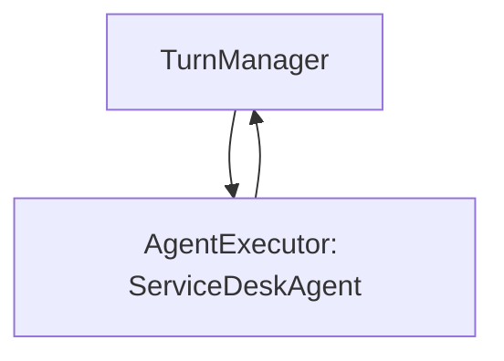
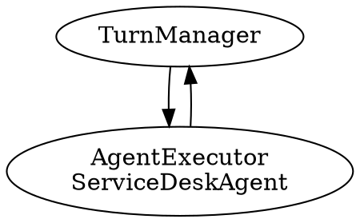

# LAB 6 – Workflows, Observabilidad y Visualización

## Descripción General

Este laboratorio final introduce conceptos avanzados del **Microsoft Agent Framework**: construcción declarativa de workflows, observabilidad con OpenTelemetry, y visualización de arquitecturas de agentes. Se implementa un sistema de Service Desk con tracing completo y diagramas generados automáticamente.

## Objetivos del LAB

1. **WorkflowBuilder**: Construcción declarativa de flujos de agentes
2. **AgentExecutor**: Ejecución estructurada de agentes en workflows
3. **TurnManager**: Coordinador de turnos de conversación
4. **Observabilidad**: Tracing con OpenTelemetry para debugging
5. **Visualización**: Generación automática de diagramas (Mermaid, DOT, SVG, PNG)

## Arquitectura del Workflow

### Componentes Principales

```
┌─────────────────────┐
│    TurnManager      │  <- Punto de entrada
│  (Coordinador)      │
└──────┬──────────────┘
       │
       │ AgentExecutorRequest
       ▼
┌─────────────────────┐
│   AgentExecutor     │  <- Ejecuta el agente
│ (ServiceDeskAgent)  │
└──────┬──────────────┘
       │
       │ AgentExecutorResponse
       ▼
┌─────────────────────┐
│    TurnManager      │  <- Procesa respuesta
│  (yield_output)     │
└─────────────────────┘
```

## TurnManager: El Coordinador

### Propósito
Executor personalizado que gestiona el flujo de mensajes entre el usuario y el agente.

### Handlers Implementados

#### Handler 1: `start`
**Entrada**: Texto del usuario (str)  
**Salida**: `AgentExecutorRequest`

```python
@handler
async def start(self, user_text: str, ctx: WorkflowContext[AgentExecutorRequest]):
    # Convierte texto en mensaje de chat
    user_msg = ChatMessage(Role.USER, text=user_text)
    
    # Crea request para el agente
    request = AgentExecutorRequest(
        messages=[user_msg],
        should_respond=True
    )
    
    # Envía al AgentExecutor
    await ctx.send_message(request)
```

#### Handler 2: `on_agent_response`
**Entrada**: `AgentExecutorResponse`  
**Salida**: Texto final del workflow (str)

```python
@handler
async def on_agent_response(
    self, 
    result: AgentExecutorResponse, 
    ctx: WorkflowContext[None, str]
):
    # Extrae texto de la respuesta del agente
    run_resp = result.agent_run_response
    text = run_resp.text
    
    # Emite como salida del workflow
    await ctx.yield_output(text)
```

## AgentExecutor: Ejecutor Integrado

### ¿Qué es?
Executor del framework que encapsula la ejecución de un `ChatAgent` dentro de un workflow estructurado.

### Características
- Recibe `AgentExecutorRequest` con mensajes
- Ejecuta el agente especificado
- Emite `AgentExecutorResponse` con resultados
- Gestiona contexto y estado automáticamente

### Creación

```python
agent_executor = AgentExecutor(
    agent=service_desk_agent,
    id="service_desk_exec"
)
```

## WorkflowBuilder: Construcción Declarativa

### API Fluida

```python
workflow = (
    WorkflowBuilder()
    .set_start_executor(turn_manager)
    .add_edge(turn_manager, agent_executor)
    .add_edge(agent_executor, turn_manager)
    .build()
)
```

### Conceptos Clave

- **Executors**: Nodos del grafo (TurnManager, AgentExecutor)
- **Edges**: Flujo de mensajes entre executors
- **Start Executor**: Punto de entrada del workflow
- **Message Types**: Tipos de datos que fluyen por las edges

### Flujo de Mensajes

```
Usuario envía texto
       ↓
TurnManager.start(texto)
       ↓ AgentExecutorRequest
AgentExecutor.run()
       ↓ AgentExecutorResponse
TurnManager.on_agent_response()
       ↓ str
yield_output(respuesta_final)
```

## Observabilidad con OpenTelemetry

### Setup

```python
from agent_framework.observability import setup_observability

setup_observability(enable_sensitive_data=True)
```

### Capacidades de Tracing

1. **Spans automáticos**: Cada handler genera un span
2. **Contexto propagado**: Trace ID persiste en todo el flujo
3. **Atributos enriquecidos**: Metadatos de agentes y mensajes
4. **Logs estructurados**: Eventos del framework trackeados
5. **Sensitive data**: Opcional incluir contenido de mensajes

### Información Capturada

- **Workflow execution**: Inicio y fin de workflows
- **Executor calls**: Entrada/salida de cada executor
- **Agent invocations**: Llamadas a LLM con tokens usados
- **Function calls**: Invocación de tools por el agente
- **Errors**: Stack traces y contexto de fallos

### Ejemplo de Trace

```
Trace: workflow_run_abc123
├─ Span: TurnManager.start
│  ├─ input: "¿Cuántos días de vacaciones tengo?"
│  └─ duration: 2ms
├─ Span: AgentExecutor.run
│  ├─ agent: ServiceDeskAgent
│  ├─ model: gpt-4o
│  ├─ tokens: {prompt: 150, completion: 50}
│  └─ duration: 1.2s
└─ Span: TurnManager.on_agent_response
   ├─ output: "Según la política, tienes 23 días..."
   └─ duration: 1ms

Total duration: 1.203s
```

## Visualización con WorkflowViz

### Creación

```python
from agent_framework import WorkflowViz

viz = WorkflowViz(workflow)
```

### Formatos Disponibles

#### 1. Mermaid (Markdown)
```python
mermaid_diagram = viz.to_mermaid()
print(mermaid_diagram)
```

**Output**:


#### 2. DOT (Graphviz)
```python
dot_diagram = viz.to_digraph()
print(dot_diagram)
```

**Output**:


#### 3. SVG (Escalable)
```python
svg_path = viz.export(format="svg")
# Genera: workflow_diagram.svg
```

#### 4. PNG (Imagen)
```python
png_path = viz.export(format="png")
# Genera: workflow_diagram.png
```

**Requisito**: Graphviz instalado en el sistema para SVG/PNG  
[https://graphviz.org/download/](https://graphviz.org/download/)

## Ejecución del Workflow

### API Stream

```python
async def run_service_desk_workflow(input_text: str):
    async for event in workflow.run_stream(input_text):
        if isinstance(event, WorkflowOutputEvent):
            print("✅ Resultado:", event.data)
```

### Tipos de Eventos

- **WorkflowOutputEvent**: Salida final del workflow
- **ExecutorStartEvent**: Inicio de un executor
- **ExecutorEndEvent**: Fin de un executor
- **MessageEvent**: Mensaje entre executors

### Ejemplo de Ejecución

```python
await run_service_desk_workflow(
    "¿Cuántos días de vacaciones tengo según la política?"
)
```

**Output observado**:
```
🚀 Ejecutando workflow Service Desk...
📡 Evento: ExecutorStartEvent(turn_manager)
🧭 [TurnManager.start] Enviando AgentExecutorRequest
📡 Evento: ExecutorStartEvent(service_desk_exec)
📡 Evento: ExecutorEndEvent(service_desk_exec)
📨 [TurnManager.on_agent_response] Texto del agente:
   Según la política de la empresa, tienes 23 días base...
📡 Evento: WorkflowOutputEvent
✅ Resultado final:
   Según la política de la empresa, tienes 23 días base...
```

## Configuración del Service Desk Agent

### Instrucciones

```python
SERVICE_DESK_INSTRUCTIONS = """
Eres un agente de Service Desk interno.

Tu trabajo es:
- Entender solicitudes en lenguaje natural
- Interpretar tipo de petición (duda, vacaciones, problema técnico)
- Responder de forma clara, profesional y en español
- Indicar tipo de ticket y prioridad si corresponde
- NO devuelvas JSON, responde en texto libre
"""
```

### Creación

```python
chat_client = OpenAIChatClient()  # Lee OPENAI_* de entorno

service_desk_agent = ChatAgent(
    chat_client=chat_client,
    name="ServiceDeskAgent",
    instructions=SERVICE_DESK_INSTRUCTIONS
)
```

## Casos de Uso Completos

### Caso 1: Consulta Simple
```python
await run_service_desk_workflow(
    "¿Cuántos días de vacaciones tengo?"
)
```

**Trace capturado**:
- Span: workflow.run
  - Span: TurnManager.start
  - Span: AgentExecutor.run
    - Span: LLM.chat_completion (gpt-4o)
  - Span: TurnManager.on_agent_response

### Caso 2: Solicitud de Ticket
```python
await run_service_desk_workflow(
    "Quiero pedir vacaciones del 1 al 15 de agosto"
)
```

**Respuesta**:
```
Entendido. Para procesar tu solicitud de vacaciones:

Tipo de ticket: RRHH - Vacaciones
Prioridad: Media
Período solicitado: 1-15 agosto (11 días laborables)

Recomiendo enviar esta petición con al menos 15 días de antelación
según la política de la empresa. ¿Deseas que proceda a crear el ticket?
```

### Caso 3: Problema Técnico Urgente
```python
await run_service_desk_workflow(
    "No puedo conectarme a la VPN y tengo reunión urgente"
)
```

**Respuesta**:
```
Entiendo la urgencia. He analizado tu problema:

Tipo de ticket: IT - Incidencia
Prioridad: ALTA (bloquea trabajo inmediato)
Categoría: Conectividad VPN

Pasos inmediatos mientras se crea el ticket:
1. Reinicia tu equipo
2. Verifica conexión a Internet
3. Comprueba que el cliente VPN esté actualizado

El ticket de alta prioridad garantiza respuesta de IT en < 30 minutos.
```

## Comparación con LAB 5

| Aspecto | LAB 5 | LAB 6 |
|---------|-------|-------|
| **Construcción** | Código Python manual | WorkflowBuilder declarativo |
| **Coordinación** | Funciones async custom | Executors + Handlers |
| **Observabilidad** | Prints manuales | OpenTelemetry automático |
| **Visualización** | No disponible | Mermaid, DOT, SVG, PNG |
| **Debugging** | Difícil rastrear flujo | Traces estructurados |
| **Escalabilidad** | Limitada | Alta (workflows complejos) |

## Ventajas del Enfoque

1. **Declarativo**: Workflow definido como grafo, no código imperativo
2. **Observable**: Tracing automático de todo el flujo
3. **Visual**: Diagramas generados automáticamente
4. **Testeable**: Fácil verificar flujo con eventos
5. **Escalable**: Agregar executors sin tocar lógica existente
6. **Debuggable**: Traces con contexto completo

## Tecnologías y Conceptos

- **WorkflowBuilder**: Patrón Builder para workflows
- **Executor Pattern**: Nodos procesadores en grafos
- **Handler Decorators**: Anotaciones para routing de mensajes
- **OpenTelemetry**: Estándar de observabilidad
- **Graphviz**: Renderizado de grafos
- **Event Streaming**: Procesamiento reactivo de eventos

## Archivos Generados

```
.
├── workflow_diagram.svg    # Diagrama vectorial escalable
├── workflow_diagram.png    # Imagen exportable
└── traces/                 # Traces de OpenTelemetry (si configurado)
    └── trace_*.json
```

## Mejores Prácticas

1. **Activar observabilidad siempre en desarrollo**
2. **Usar WorkflowViz para documentar arquitectura**
3. **Nombrar executors descriptivamente** (`id="nombre_claro"`)
4. **Handlers específicos** (un propósito por handler)
5. **Validar tipos** en WorkflowContext genéricos
6. **Exportar diagramas** para documentación de proyectos

## Conclusión del Workshop

Este LAB cierra el ciclo completo de desarrollo de agentes con Microsoft Agent Framework:

- **LAB 1**: Agente básico con clasificación
- **LAB 2**: Function calling y tools
- **LAB 3**: Memoria y perfiles de usuario
- **LAB 4**: Knowledge base y MCP
- **LAB 5**: Workflow multiagente con router
- **LAB 6**: Observabilidad y visualización profesional

El resultado es un **Service Desk inteligente** completo con:
- ✅ Clasificación automática de solicitudes
- ✅ Gestión de tickets con persistencia
- ✅ Memoria de preferencias de usuario
- ✅ Consulta de base de conocimiento
- ✅ Orquestación multiagente
- ✅ Observabilidad y tracing
- ✅ Documentación visual automática
